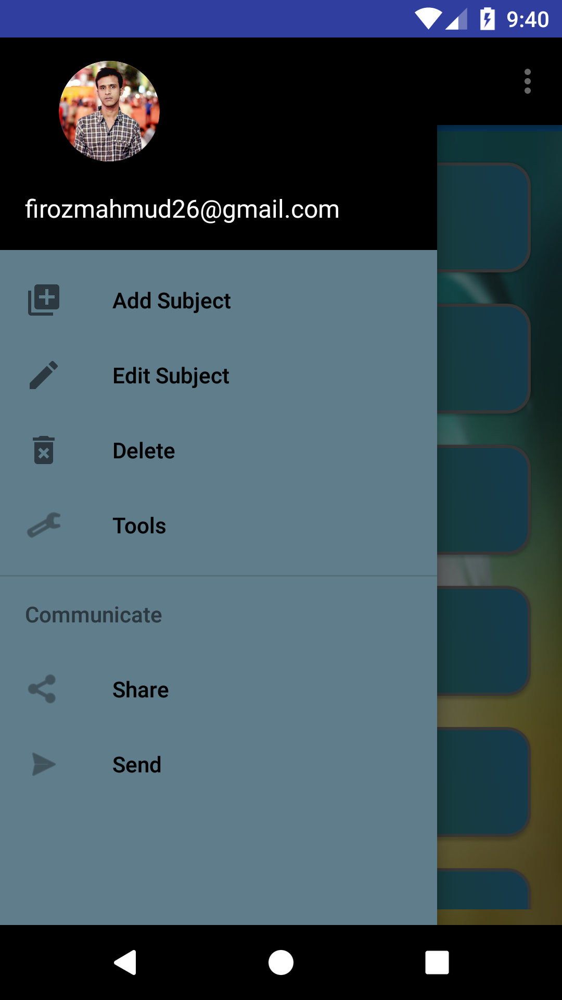
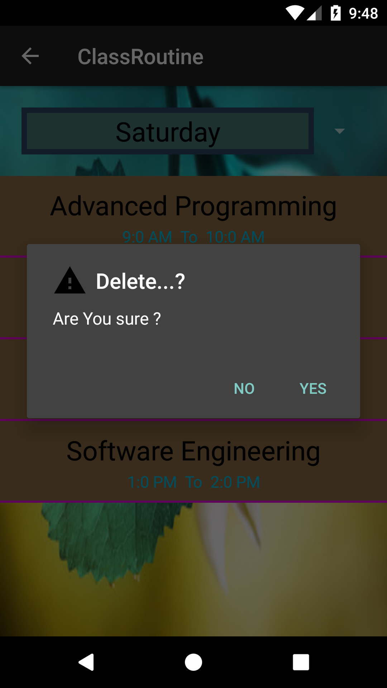

# ClassRoutine
This Android app help user to create their class routine. I use here SQLite database for store the information and Expandable listview to display the information.

Below the sample images of this project.

 </img>

 </img>

 </img>

 </img>

 </img>

 </img>

 </img>

 </img>
